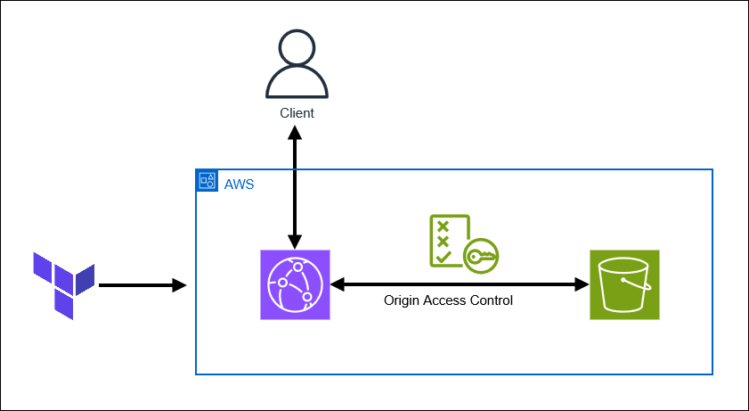

# Static Website hosted on AWS (S3 & CloudFront) in Terraform

## Description

This repository allows you to deploy the infrastructure to host a static website on AWS using Terraform. The website is hosted on a private S3 bucket and the content of the website is exposed publicly via a CloudFront distribution. The CloudFront distribution gets restricted access to the S3 bucket content via OAC (Origin Access Control).



The content of the website is stored in `/website/`, but here only a basic html is stored. This infrastructure can be used to serve any static website, it only requires you to copy your static files on the S3 bucket.

The website is served over the default CloudFront secured domain name associated with the created distribution. The URL can be found in the CloudFront Console, or can be viewed in the output of the `terraform apply` command.

All resources are tagged with the tags defined in `/locals.tf`:

```
common_tags = {
    Project     = var.project_name
    Environment = var.environment
}
```

The variables are defined in `terraform.tfvars` or, if no value is provided in the env variables, in `/variables.tf` with the default value.

## Pre-requisites

- terraform cli
- aws cli
- AWS SSO profile configured

## Installation

```
$ terraform init

$ terraform validate

# Login via AWS SSO
$ aws sso login --profile iam-gen-cli-user && export AWS_DEFAULT_PROFILE=iam-gen-cli-user

$ terraform plan

$ terraform apply
```

## Clean up

To destroy the stack, you first need to empty the S3 bucket. Then, destroy the stack.

```
$ terraform destroy
```
